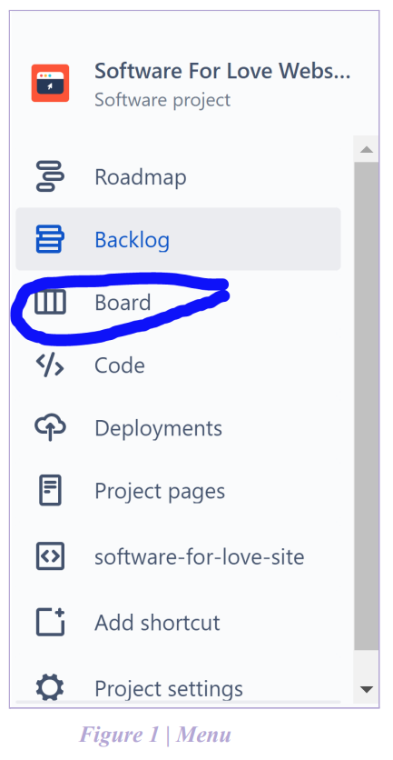
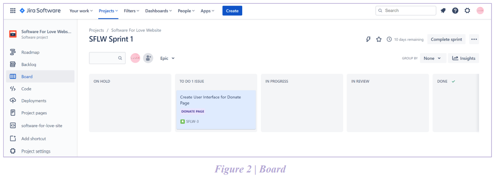
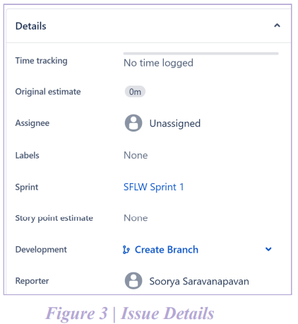
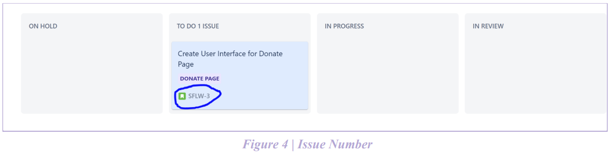

# Using Jira
Jira is a software issue tracking product that helps with agile project management and bug tracking. Some teams at Software For Love use Jira. This page hopes to serve as a guide for teams using Jira.

## Introduction to Jira
If your team is using Jira, ensure that you are a member of your Jira project. If you cannot access the project, please contact your project manager.

For developers, the only tab which they may interact with is ‘Board’ as shown in Figure 1. Project Managers may access all other tabs listed except 'Project Settings'. 

## Project Board
The image in Figure 2 depicts the Board which will list all the issues active during the current sprint. The five columns outlined correspond to the status of each issue in the sprint. An issue will always start in 'To-Do' and can be moved to 'In Progress' once a developer has started working on it. If for some reason the issue cannot be worked on for a brief interval, the issue can be moved to 'On Hold' subject to the discretion of the project manager. Once a pull request has been opened for the issue, it can be moved to 'In Review'. If the pull request is approved and the branch is merged, the issue can be moved to 'Done'. 

## The creation of User Stories and Epics
Please refer to the subsection dedicated to describing the creation of user stories and epics [here.](https://software-for-love.github.io/documentation/best_practises/pm.html)

## Issues
When an issue has been assigned to you, a description of the issue can be found when you open the issue through the board. Information which you will be responsible for adding to the issue is **'Time Tracking'** and **'Original Estimate'**. Prior to starting the issue, you and the project manager must reach a consensus on approximately how long this issue could potentially take to complete. You can enter the agreed upon estimate in the **'Original Estimate'** field. While the issue is in progress, everytime you work on the issue you can enter the time spent on it within the **'Time Tracking'** field. 

## Github Integration
To ensure that JIRA and our Github repository are linked there are a few naming conventions we must
follow. The number of the issue which you are working on must be included in the naming processes. The
issue number can be seen on the board as shown in Figure 4.

1. While creating a branch the branch name must include the issue number in the beginning. The
name of a branch associated with the issue in Figure 4 could be: 'SFLW-3 / name of branch'.
2. While creating a commit message, the issue number must also be included in the beginning. The
commit message for the issue in Figure 4 could be: 'SFLW-3 / appropriate commit message'. 
